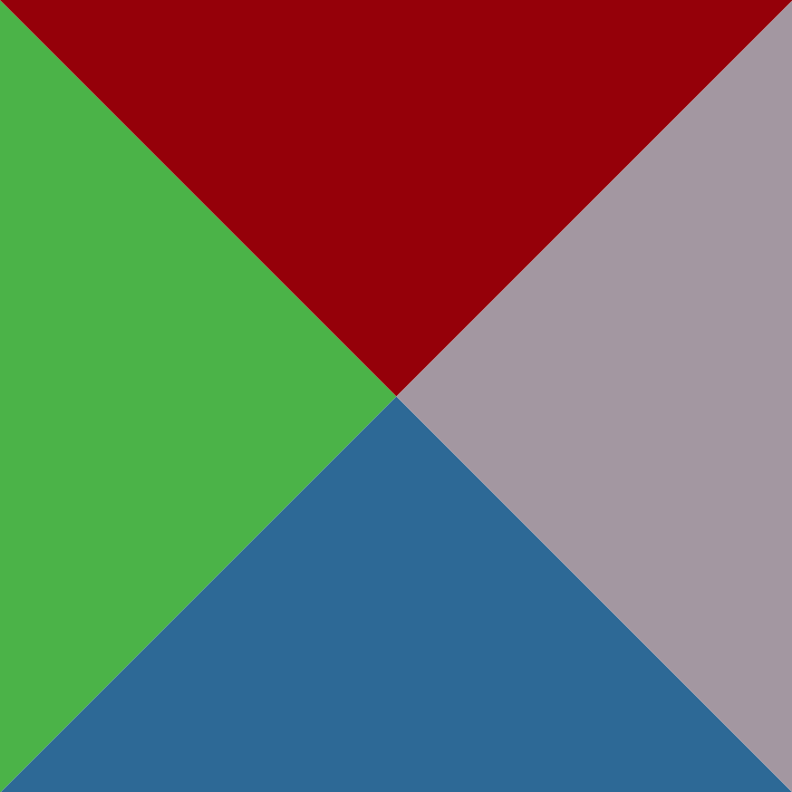
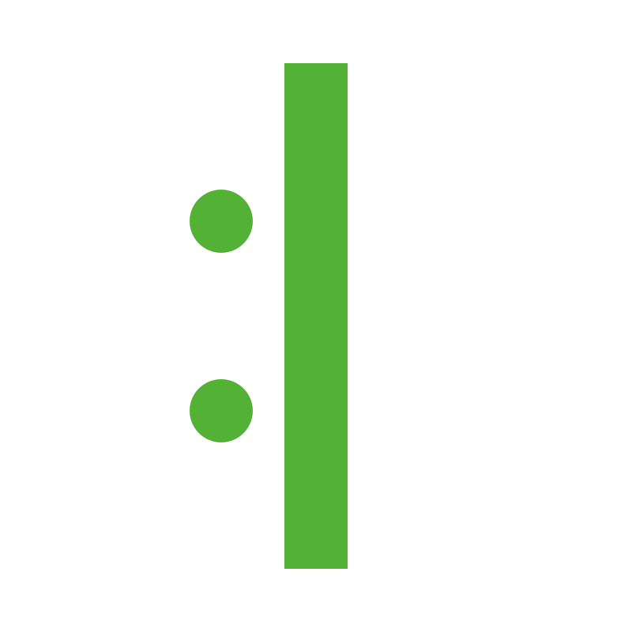
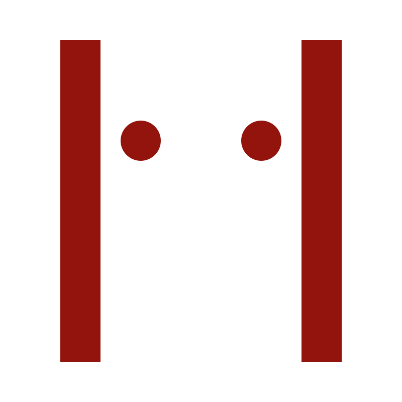
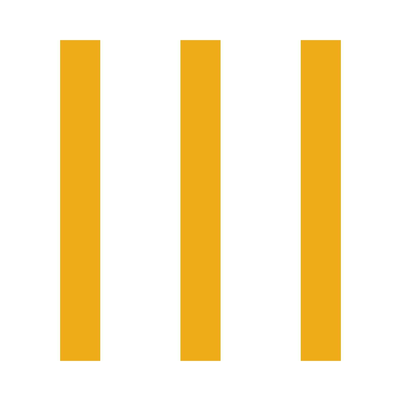
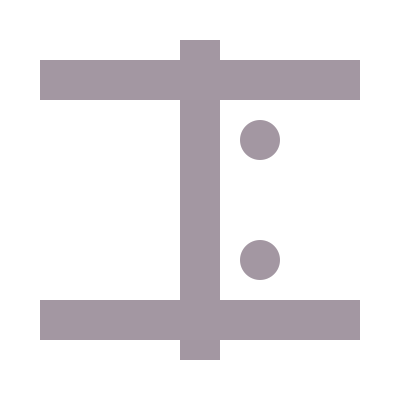

import Elements from '../../src/components/Elements'

<Elements />

# And Then There Were Five

It is said that the five [elements](elements) represent different states of change. 🤔

On a less abstract note, it may be easier to think of them as symbols representing the remaining *seven luminaries* after taking away the moon and the sun (represented by [Yin](yin) and [Yang](yang)).

## Cardinal Official

## Connecting the Dots

Every [TZI Card](/) has an element that can be determined by the color on the card and the placement of two dots. For yang polarity the glyph is the color, for yin polarity the background is the color

### 🌲 Wood

To the left

### 🔥 Fire

Up on top

### 🌎 Earth

Nada dotta

### 🎸 Metal

To the right

### 🌊 Water

Down below

Next -> [The Twelve Animals](animals)

